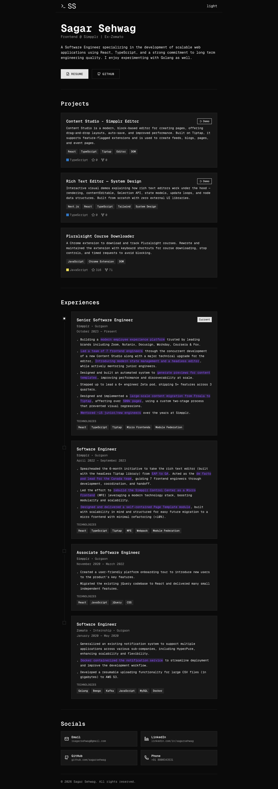
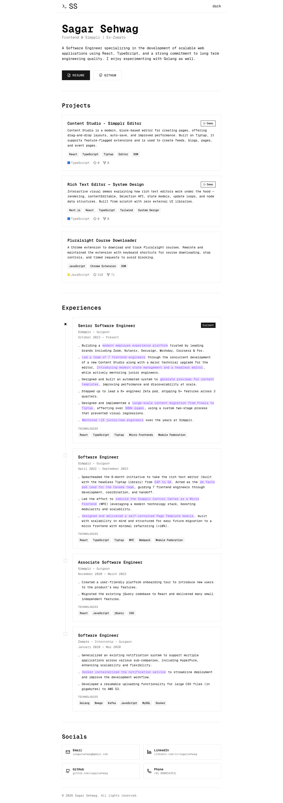
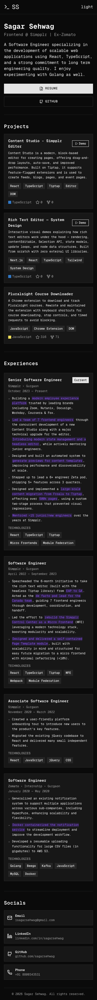
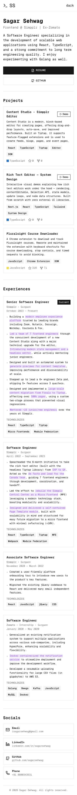

# Sagar Sehwag - Portfolio

A minimal, monospace-themed developer portfolio built with Next.js, TypeScript, and Tailwind CSS. Features dark/light mode, semantic text highlighting, responsive typography tuned for readability, and a clean timeline layout. Fully responsive and deployed on both GitHub Pages and Vercel.

**[sagarsehwag.github.io](https://sagarsehwag.github.io)** | **[sagarsehwag.vercel.app](https://sagarsehwag.vercel.app)**

---

## Screenshots

### Desktop

<table>
  <tr>
    <td align="center"><strong>Dark Mode</strong></td>
    <td align="center"><strong>Light Mode</strong></td>
  </tr>
  <tr>
    <td></td>
    <td></td>
  </tr>
</table>

### Mobile

<table>
  <tr>
    <td align="center"><strong>Dark Mode</strong></td>
    <td align="center"><strong>Light Mode</strong></td>
  </tr>
  <tr>
    <td></td>
    <td></td>
  </tr>
</table>

---

## Tech Stack

| Category       | Technology                                              |
| -------------- | ------------------------------------------------------- |
| **Framework**  | [Next.js 16](https://nextjs.org/) (App Router)         |
| **Language**   | [TypeScript](https://www.typescriptlang.org/)           |
| **Styling**    | [Tailwind CSS v4](https://tailwindcss.com/)             |
| **Components** | [shadcn/ui](https://ui.shadcn.com/) + Radix Primitives |
| **Font**       | [Geist Mono](https://vercel.com/font)                   |
| **Theming**    | [next-themes](https://github.com/pacocoursey/next-themes) (dark/light) |
| **Icons**      | [Lucide React](https://lucide.dev/)                     |

---

## Features

- **Dark / Light mode** — System-aware toggle with next-themes
- **Semantic text highlighting** — Key experience achievements highlighted using native `<mark>` elements with a violet accent that works in both themes
- **Responsive typography** — Custom font size overrides tuned for readability at mobile, tablet, and desktop breakpoints (meets WCAG minimums)
- **Monospace aesthetic** — Geist Mono throughout for a developer-focused feel
- **Project demo dialogs** — Inline iframe previews with video and live demo support
- **Timeline layout** — Work experience displayed with a vertical timeline and dot indicators

---

## Sections

- **Hero** — Introduction, role, resume preview, and quick links
- **Projects** — Notable work with tech tags, GitHub stats, and live demo dialogs
- **Experience** — Timeline of roles with highlighted bullet points
- **Skills** — Categorized skill tags
- **Socials** — Email, LinkedIn, GitHub, Phone
- **Footer** — Copyright

---

## Getting Started

```bash
# Clone the repository
git clone https://github.com/sagarsehwag/sagarsehwag.github.io.git
cd sagarsehwag.github.io

# Install dependencies
npm install

# Start the development server
npm run dev
```

Open [http://localhost:3000](http://localhost:3000) to view the site.

---

## Build & Deploy

```bash
# Production build (outputs static files to ./out)
npm run build
```

### GitHub Pages

Deployments are automated via GitHub Actions. Every push to `main` triggers a build and deploys the static output to GitHub Pages.

See [`.github/workflows/deploy.yml`](.github/workflows/deploy.yml) for the workflow configuration.

### Vercel

The repository is connected to Vercel for automatic deployments. Every push to `main` triggers a production deployment.

---

## Project Structure

```
src/
  app/
    globals.css        # Theme variables, font config, responsive overrides, mark styling
    layout.tsx         # Root layout with header, theme provider, metadata
    page.tsx           # Home page composing all sections
  components/
    hero.tsx           # Hero section with intro and CTA buttons
    projects.tsx       # Project cards with tags, stats, and demo dialogs
    experience.tsx     # Work experience timeline with highlighted bullets
    skills.tsx         # Categorized skill tags
    education.tsx      # Education card
    socials.tsx        # Social links grid
    footer.tsx         # Footer with copyright
    theme-provider.tsx # next-themes provider wrapper
    theme-toggle.tsx   # Dark/light mode toggle
    ui/                # shadcn/ui primitives (badge, button, card, dialog, separator)
  lib/
    utils.ts           # Utility functions (cn)
```

---

## Regenerate Screenshots

```bash
node scripts/capture-screenshots.mjs
```

Requires Playwright with Chromium installed (`npx playwright install chromium`).

---

## License

This project is open source and available for reference. Feel free to take inspiration for your own portfolio.
